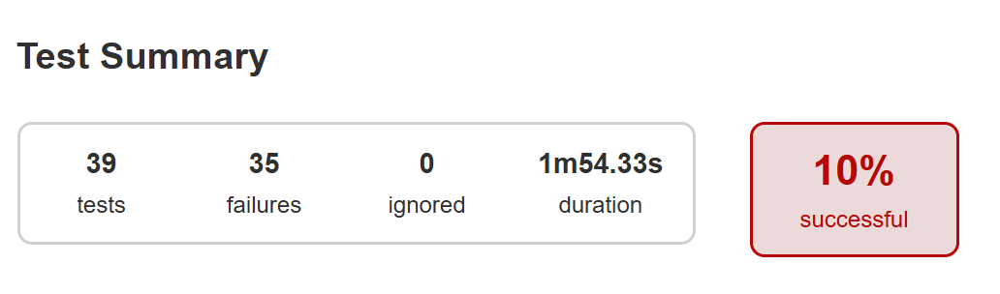

# Отчёт по итогам тестирования
Результаты проведённых автоматизированных тестов формы покупки тура "Путешествие дня - Марракэш" с помощью дебетовой и кредитной карты.
## Количество тест-кейсов
UI-tests: 23. Passed - 0, Failed - 23.

API-tests: 16. Passed - 4, Failed - 12.

% Passed - 10; % Failed - 90.

Всего было проведено 39 автоматизированных тестов. Этот результат одинаков для обеих подключенных баз данных MySQL и PostgreSQL.

## Итоги автоматизированного тестирования:
В результате прогона тестов заведены 7 issues.

## Общие рекомендации:
1. Исправить баги.
2. Обратить внимание на заполнение таблицы базы данных.
3. Обратить внимание на несоответствие названий кнопок на странице сайта и внутри приложения.
4. Форма с одним пустым полем не должна отправляться. Из плюсов: совсем незаполненная форма не отправляется, отображается код 400.
2. Необходима техническая документация по проекту.